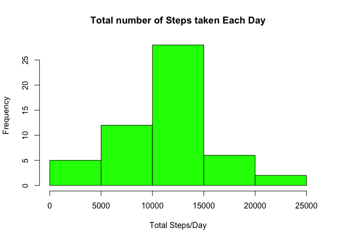
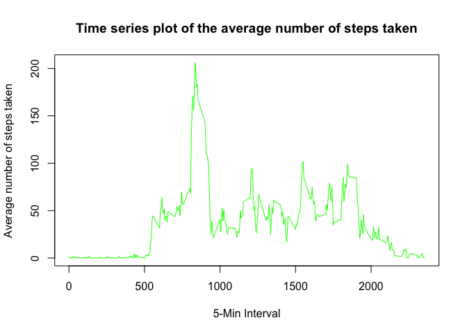
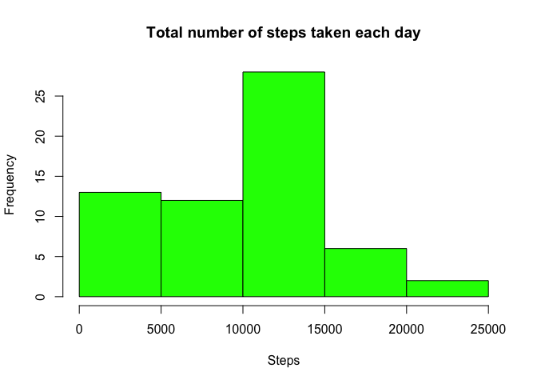
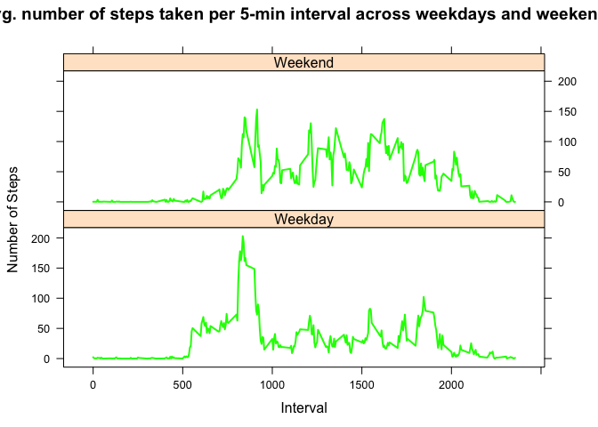

# 𝙿𝙰𝟷_𝚝𝚎𝚖𝚙𝚕𝚊𝚝𝚎.𝚁𝚖𝚍
Santosh Waikar  
January 22, 2016  

Use follwoing link to download raw data
https://d396qusza40orc.cloudfront.net/repdata%2Fdata%2Factivity.zip

Fork/clone the GitHub repository created for this assignment.
http://github.com/rdpeng/RepData_PeerAssessment1

1. Dataset: Activity monitoring data [52K]
  https://d396qusza40orc.cloudfront.net/repdata%2Fdata%2Factivity.zip
2. The variables included in this dataset are:
3. steps: Number of steps taking in a 5-minute interval (missing values are coded as 𝙽𝙰)
4. date: The date on which the measurement was taken in YYYY-MM-DD format
5. interval: Identifier for the 5-minute interval in which measurement was taken

The dataset is stored in a comma-separated-value (CSV) file and there are a total of 17,568 observations in this dataset.


```r
#load Package
library(ggplot2)
library(plyr)
library(lattice)
```

# 1. Code for reading in the dataset and/or processing the data

```r
# Use follwoing link to download raw data
# https://d396qusza40orc.cloudfront.net/repdata%2Fdata%2Factivity.zip

#Load the data using read.csv()
totalData <- read.csv("activity.csv")
#head(totalData)

#Process/transform the data (if necessary) into a format suitable for your analysis
totalData$date <- as.Date(totalData$date, "%Y-%m-%d")
#head(totalData)
```

# 2. Histogram of the total number of steps taken each day

```r
#Calculate the total number of steps taken per day
totalStepsData <- aggregate(steps ~ date, totalData, sum, na.rm = TRUE)
#head(totalStepsData)

#Make a histogram of the total number of steps taken each day
hist(totalStepsData$steps, main = "Total number of Steps taken Each Day", xlab = "Total Steps/Day", ylab = "Frequency", col = "green")
```

 

# 3. Mean and median number of steps taken each day

```r
#Calculate and report the mean and median of the total number of steps taken per day
#Total Summary
summary(totalStepsData)
```

```
##       date                steps      
##  Min.   :2012-10-02   Min.   :   41  
##  1st Qu.:2012-10-16   1st Qu.: 8841  
##  Median :2012-10-29   Median :10765  
##  Mean   :2012-10-30   Mean   :10766  
##  3rd Qu.:2012-11-16   3rd Qu.:13294  
##  Max.   :2012-11-29   Max.   :21194
```

```r
#Mean of the total number of steps taken per day
mean(totalStepsData$steps)
```

```
## [1] 10766.19
```

```r
#Median of the total number of steps taken per day
median(totalStepsData$steps)
```

```
## [1] 10765
```

# 4. Time series plot of the average number of steps taken

```r
# Make a time series plot (i.e. 𝚝𝚢𝚙𝚎 = "𝚕") of the 5-minute interval (x-axis) and the average number of steps taken, averaged across all days (y-axis)
averageIntervalStepsTaken <- ddply(totalData, .(interval), summarise, AveSteps = mean(steps, na.rm = T))
head(averageIntervalStepsTaken)
```

```
##   interval  AveSteps
## 1        0 1.7169811
## 2        5 0.3396226
## 3       10 0.1320755
## 4       15 0.1509434
## 5       20 0.0754717
## 6       25 2.0943396
```

```r
#averageIntervalStepsTaken <- aggregate(steps~interval, totalData, mean, na.rm = TRUE)
#head(averageIntervalStepsTaken)

plot(AveSteps~interval,averageIntervalStepsTaken, type = "l", main = "Time series plot of the average number of steps taken", xlab = "5-Min Interval", ylab = "Average number of steps taken", col = "green")
```

 

# 5. The 5-minute interval that, on average, contains the maximum number of steps

```r
# Which 5-minute interval, on average across all the days in the dataset, contains the maximum number of steps?
maxSteps <- which.max(averageIntervalStepsTaken$AveSteps)

averageIntervalStepsTaken$AveSteps[maxSteps]
```

```
## [1] 206.1698
```

```r
#5-min interval
averageIntervalStepsTaken$interval[maxSteps]
```

```
## [1] 835
```

# 6. Code to describe and show a strategy for imputing missing data

```r
# Note that there are a number of days/intervals where there are missing values (coded as 𝙽𝙰). The presence of missing days may introduce bias into some calculations or summaries of the data.

# 1. Calculate and report the total number of missing values in the dataset (i.e. the total number of rows with 𝙽𝙰s)
summary(totalData)
```

```
##      steps             date               interval     
##  Min.   :  0.00   Min.   :2012-10-01   Min.   :   0.0  
##  1st Qu.:  0.00   1st Qu.:2012-10-16   1st Qu.: 588.8  
##  Median :  0.00   Median :2012-10-31   Median :1177.5  
##  Mean   : 37.38   Mean   :2012-10-31   Mean   :1177.5  
##  3rd Qu.: 12.00   3rd Qu.:2012-11-15   3rd Qu.:1766.2  
##  Max.   :806.00   Max.   :2012-11-30   Max.   :2355.0  
##  NA's   :2304
```

```r
sum(is.na(totalData$steps))
```

```
## [1] 2304
```

```r
# 2. Devise a strategy for filling in all of the missing values in the dataset. The strategy does not need to be sophisticated. For example, you could use the mean/median for that day, or the mean for that 5-minute interval, etc.
head(averageIntervalStepsTaken)
```

```
##   interval  AveSteps
## 1        0 1.7169811
## 2        5 0.3396226
## 3       10 0.1320755
## 4       15 0.1509434
## 5       20 0.0754717
## 6       25 2.0943396
```

```r
head(totalData)
```

```
##   steps       date interval
## 1    NA 2012-10-01        0
## 2    NA 2012-10-01        5
## 3    NA 2012-10-01       10
## 4    NA 2012-10-01       15
## 5    NA 2012-10-01       20
## 6    NA 2012-10-01       25
```

```r
activityMerge <- merge(totalData, averageIntervalStepsTaken)
head(activityMerge)
```

```
##   interval steps       date AveSteps
## 1        0    NA 2012-10-01 1.716981
## 2        0     0 2012-11-23 1.716981
## 3        0     0 2012-10-28 1.716981
## 4        0     0 2012-11-06 1.716981
## 5        0     0 2012-11-24 1.716981
## 6        0     0 2012-11-15 1.716981
```

```r
summary(activityMerge) 
```

```
##     interval          steps             date               AveSteps      
##  Min.   :   0.0   Min.   :  0.00   Min.   :2012-10-01   Min.   :  0.000  
##  1st Qu.: 588.8   1st Qu.:  0.00   1st Qu.:2012-10-16   1st Qu.:  2.486  
##  Median :1177.5   Median :  0.00   Median :2012-10-31   Median : 34.113  
##  Mean   :1177.5   Mean   : 37.38   Mean   :2012-10-31   Mean   : 37.383  
##  3rd Qu.:1766.2   3rd Qu.: 12.00   3rd Qu.:2012-11-15   3rd Qu.: 52.835  
##  Max.   :2355.0   Max.   :806.00   Max.   :2012-11-30   Max.   :206.170  
##                   NA's   :2304
```

```r
# 3. Create a new dataset that is equal to the original dataset but with the missing data filled in.
activityMerge$steps[is.na(activityMerge$steps)] <- activityMerge$AveSteps
```

```
## Warning in activityMerge$steps[is.na(activityMerge$steps)] <- activityMerge
## $AveSteps: number of items to replace is not a multiple of replacement
## length
```

```r
summary(activityMerge) 
```

```
##     interval          steps              date               AveSteps      
##  Min.   :   0.0   Min.   :  0.000   Min.   :2012-10-01   Min.   :  0.000  
##  1st Qu.: 588.8   1st Qu.:  0.000   1st Qu.:2012-10-16   1st Qu.:  2.486  
##  Median :1177.5   Median :  0.000   Median :2012-10-31   Median : 34.113  
##  Mean   :1177.5   Mean   : 32.540   Mean   :2012-10-31   Mean   : 37.383  
##  3rd Qu.:1766.2   3rd Qu.:  1.717   3rd Qu.:2012-11-15   3rd Qu.: 52.835  
##  Max.   :2355.0   Max.   :806.000   Max.   :2012-11-30   Max.   :206.170
```

```r
activityMerge$avesteps <- NULL
summary(activityMerge) 
```

```
##     interval          steps              date               AveSteps      
##  Min.   :   0.0   Min.   :  0.000   Min.   :2012-10-01   Min.   :  0.000  
##  1st Qu.: 588.8   1st Qu.:  0.000   1st Qu.:2012-10-16   1st Qu.:  2.486  
##  Median :1177.5   Median :  0.000   Median :2012-10-31   Median : 34.113  
##  Mean   :1177.5   Mean   : 32.540   Mean   :2012-10-31   Mean   : 37.383  
##  3rd Qu.:1766.2   3rd Qu.:  1.717   3rd Qu.:2012-11-15   3rd Qu.: 52.835  
##  Max.   :2355.0   Max.   :806.000   Max.   :2012-11-30   Max.   :206.170
```

```r
# 4. Make a histogram of the total number of steps taken each day and Calculate and report the mean and median total number of steps taken per day. Do these values differ from the estimates from the first part of the assignment? What is the impact of imputing missing data on the estimates of the total daily number of steps?
totalDailySteps <- ddply(activityMerge, .(date), summarise, totalSteps = sum(steps))
str(totalDailySteps)
```

```
## 'data.frame':	61 obs. of  2 variables:
##  $ date      : Date, format: "2012-10-01" "2012-10-02" ...
##  $ totalSteps: num  129 126 11352 12116 13294 ...
```

```r
head(totalDailySteps)
```

```
##         date totalSteps
## 1 2012-10-01   128.9245
## 2 2012-10-02   126.0000
## 3 2012-10-03 11352.0000
## 4 2012-10-04 12116.0000
## 5 2012-10-05 13294.0000
## 6 2012-10-06 15420.0000
```

# 7. Histogram of the total number of steps taken each day after missing values are imputed

```r
hist(totalDailySteps$totalSteps, main = "Total number of steps taken each day", xlab = "Steps", col = "green")
```

 

```r
#Mean
mean(totalDailySteps$totalSteps)
```

```
## [1] 9371.437
```

```r
#Median
median(totalDailySteps$totalSteps)
```

```
## [1] 10395
```

# 8. Panel plot comparing the average number of steps taken per 5-minute interval across weekdays and weekends

```r
##findout day of week and put new column on with the dayOfWeek
activityMerge$dayOfWeek <- weekdays(activityMerge$date)
head(activityMerge)
```

```
##   interval    steps       date AveSteps dayOfWeek
## 1        0 1.716981 2012-10-01 1.716981    Monday
## 2        0 0.000000 2012-11-23 1.716981    Friday
## 3        0 0.000000 2012-10-28 1.716981    Sunday
## 4        0 0.000000 2012-11-06 1.716981   Tuesday
## 5        0 0.000000 2012-11-24 1.716981  Saturday
## 6        0 0.000000 2012-11-15 1.716981  Thursday
```

```r
activityMerge$dayOfWeek[activityMerge$dayOfWeek == "Saturday" | activityMerge$dayOfWeek == "Sunday"] <- "Weekend"
activityMerge$dayOfWeek[activityMerge$dayOfWeek != "Weekend"] <- "Weekday"
activityMerge$dayOfWeek <- as.factor(activityMerge$dayOfWeek)
head(activityMerge)
```

```
##   interval    steps       date AveSteps dayOfWeek
## 1        0 1.716981 2012-10-01 1.716981   Weekday
## 2        0 0.000000 2012-11-23 1.716981   Weekday
## 3        0 0.000000 2012-10-28 1.716981   Weekend
## 4        0 0.000000 2012-11-06 1.716981   Weekday
## 5        0 0.000000 2012-11-24 1.716981   Weekend
## 6        0 0.000000 2012-11-15 1.716981   Weekday
```

```r
dayOfWeekActivity <- ddply(activityMerge, .(interval, dayOfWeek), summarise, AveSteps = mean(steps))
summary(dayOfWeekActivity)
```

```
##     interval        dayOfWeek      AveSteps     
##  Min.   :   0.0   Weekday:288   Min.   :  0.00  
##  1st Qu.: 588.8   Weekend:288   1st Qu.:  1.64  
##  Median :1177.5                 Median : 22.85  
##  Mean   :1177.5                 Mean   : 34.22  
##  3rd Qu.:1766.2                 3rd Qu.: 54.56  
##  Max.   :2355.0                 Max.   :202.98
```

```r
head(dayOfWeekActivity)
```

```
##   interval dayOfWeek  AveSteps
## 1        0   Weekday 2.2511530
## 2        0   Weekend 0.2146226
## 3        5   Weekday 0.6289308
## 4        5   Weekend 0.2146226
## 5       10   Weekday 0.3844864
## 6       10   Weekend 0.2146226
```

```r
xyplot(AveSteps ~ interval | dayOfWeek, dayOfWeekActivity, type = "l", lwd = 2, layout = c(1, 2), main="Avg. number of steps taken per 5-min interval across weekdays and weekends", ylab = "Number of Steps", xlab = "Interval", col="green")
```

 

# 9. All of the R code needed to reproduce the results (numbers, plots, etc.) in the report

```r
# Done!!!
```

